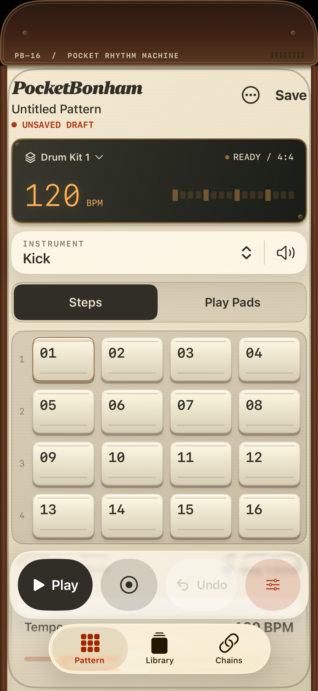
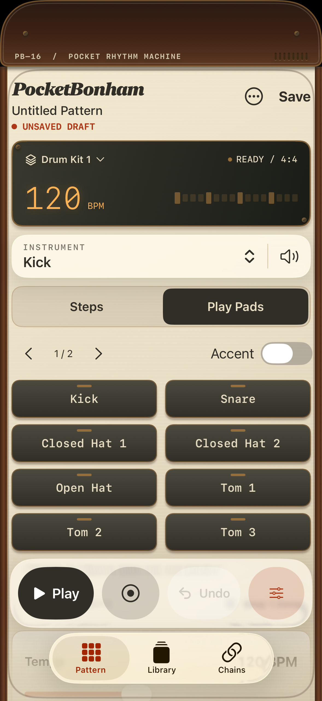

# PocketBonham

**A little machine. A big pocket.**

PocketBonham is a native iPhone drum machine for turning a rhythm into a saved groove. Program a 16-step pattern, play it with your fingers, shape individual hits, and arrange patterns into a looping song—all offline.

Built with **SwiftUI · UIKit · AVAudioEngine · Swift · C++17** for **iOS 18+**.

  
  &nbsp;&nbsp;
  

<em>Actual iPhone simulator captures: step sequencing and touch-down performance pads.</em>

## From an idea to a groove

Choose a drum and place hits on the grid. Hold a lit step and slide up or down to set its velocity. Dial in swing, add a snare roll, or pitch a single tom without changing the rest of the track. Switch to pads to overdub a performance, then save the pattern and combine it with others in a chain.

A fixed rounded top cap surrounds the camera area, making the phone feel like the instrument itself. The interface borrows the focus of a small hardware instrument: walnut edges, cream keycaps, brass details, dark pads and an amber tempo display. A direct instrument dropdown and floating glass transport bring that vintage character into a modern iPhone interface. [See the per-note velocity fader](docs/images/velocity.png).

| Make the beat | Give it character | Build the arrangement |
|---|---|---|
| 16 steps in 4/4; 40–240 BPM | 50–75% swing | Separate pattern and chain libraries |
| Four-click count-in | Per-hit levels and up to 16 retriggers | Reorder entries and repeat each 1–16 times |
| Touch-down pads and quantized overdub | Pitch, decay and per-step parameter locks | Up to 64 entries with tempo overrides |
| Undo/redo and recoverable drafts | Record pitch/decay motion; optional short room | Preloaded transitions between kits |

Drum Kit 1 includes nine original sounds. Both closed-hat variants and open/closed pairs can layer on the same step; a later hat hit chokes earlier tails. Pads span two pages so every instrument remains reachable.

## Engineering behind the instrument

**Timing lives in the audio callback.** A dedicated C++ sampler schedules swung steps and retriggers from absolute sample-frame positions. SwiftUI displays the transport; it does not drive the musical clock. The renderer uses fixed-capacity queues and voice pools, with sample decoding and file access kept outside the callback.

**Performance and editing stay connected.** UIKit pads respond on touch-down. Audio-clock feedback turns pitch and decay gestures into step locks. Complete playback snapshots let the editor publish changes without modifying the plan currently being rendered.

**Saved work has a clear lifecycle.** A Swift actor serializes JSON persistence, revision checks, atomic replacement, recovery drafts and backups. Chains reference saved patterns, so an unfinished edit does not silently change an arrangement.

**Sound preparation is explicit.** Manifest-driven kits preserve original sample files, validate SHA-256 hashes, support mono/stereo WAV and MP3, and enforce a combined decoded-audio budget before playback.

Explore the [audio architecture](docs/Audio-Architecture.md) and [data model](docs/Data-Model.md).

## Project status

A working development application with Drum Kit 1 integrated. The latest regression run passed **28 core tests and all six simulator UI tests**; the optional one-hour offline timing test passed in an earlier run. A signed iPhone Release build also succeeds.

Two additional owner kits and physical-device acceptance remain on the [roadmap](docs/Milestones.md). Simulator and offline results do not establish physical touch-to-sound latency or one-hour hardware stability. There is no App Store release linked here.

The current scope is intentionally focused: local composition and foreground playback, with no account, cloud service, microphone permission or third-party runtime package. MIDI, audio export and in-app sample import are outside this version.

## Explore the project

- [Player guide](docs/User-Guide.md) — make a beat, record pads, save and arrange.
- [Developer guide](docs/Development.md) — run the app in Xcode and understand the source layout.
- [Testing guide](docs/Testing.md) — repeatable checks and the limits of each kind of evidence.
- [Documentation index](docs/README.md) — architecture, formats, decisions and validation reports.
- [AI-agent entry point](AGENTS.md) and [current project context](AI_CONTEXT.md).

To try the source, clone this repository and open `PocketBonham.xcodeproj` in Xcode. Select the **PocketBonham** scheme and an iPhone simulator, then Run. Physical installation requires your own development signing configuration; details are in the developer guide.

Project by [mkodithuwakku](https://github.com/mkodithuwakku). Source and sound-asset licensing are documented in [Asset and License Notes](docs/Asset-and-License-Notes.md); no open-source license has been selected for this repository.
