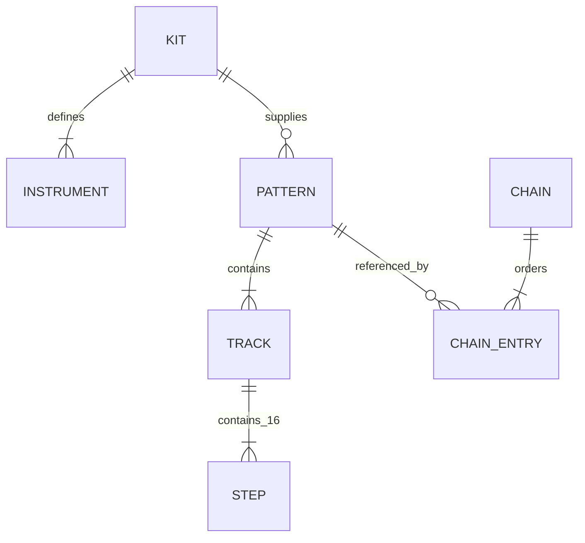

# Data model and storage

The persisted library is local JSON. `BonhamCore` owns the models and validation; the `Repository` actor is the single serialization boundary for storage operations. The library index is reconstructed from files rather than stored as a separate database.

## Relationships



A pattern references one kit ID and asset version. Its track IDs must match the kit's instrument IDs exactly before playback. Chain entries reference saved pattern UUIDs; they do not embed an editable copy of the pattern in their persisted form. At Play, references resolve to an in-memory playback snapshot.

## Pattern

| Field | Meaning and constraints |
|---|---|
| `schemaVersion` | Currently 1 |
| `id`, `revision` | Stable UUID; revision starts at 0 before first save and increments on successful save |
| `name` | Trimmed on save; validated as 1–64 characters with visible content |
| `createdAt`, `updatedAt` | ISO-8601 dates; update time changes on canonical save |
| `kitID`, `kitAssetVersion` | Required sound identity and version |
| `bpm`, `swing` | 40–240 BPM; fractional swing 0.5–0.75 |
| `tracks` | 1–16 unique instrument IDs; each has exactly 16 steps |
| `room` | Enabled flag, amount 0–0.3, fixed `smallRoom-v1` preset identity |

A track stores base level (0–1), pitch (−12 to +12 semitones), decay (0.05–1) and its step array. Each step stores enabled state, level (1–127), retrigger count (1/2/4/8/16), and optional pitch/decay locks. A missing lock inherits the track value. Display selection, playhead state and transient mutes/solos are not persisted as musical track content.

## Chain

A chain has its own schema version, UUID, revision, name and timestamps. Each entry has an independent UUID, a `patternID`, repeat count (1–16), and optional BPM override (40–240). Repeated references to the same pattern are allowed because entry identity is separate from pattern identity.

A saved chain requires 1–64 entries; an unsaved draft may be empty. Saving verifies that referenced canonical patterns exist and validate. Playback additionally checks required kit identities and versions. Duration sums `repeatCount × 240 / effectiveBPM` seconds for each entry.

The repository protects deletion against references from saved chains, recoverable chain drafts and the current unsaved chain supplied by the caller. Unreadable saved chain data is handled conservatively rather than assuming it contains no references.

## Kit and instrument identity

A kit manifest has a stable string ID, display name, schema and asset version, and 1–16 instruments. Instrument IDs and display order values are unique within a kit. File paths must be supported relative paths without parent traversal. Optional hashes and trim frames are validated during decoding.

`hatType` is optional additive metadata (`closed` or `open`), used with `chokeGroup: "hats"`. Older manifests without this field retain standard role classification for `closedHat` and `openHat`. Classification identifies which voices participate in choking; current collision behavior layers all same-frame hats.

Do not rename IDs to change display labels. Deliberately replacing a sound requires an asset-version decision; a pattern that requests another version must not silently play different samples. Full manifest examples and integration steps are in [Kit Format](Kit-Format.md).

## Storage layout

Under the app's Application Support directory:

```text
PocketBonham/
  preferences.json
  patterns/<UUID>.json
  chains/<UUID>.json
  recovery/<UUID>.json
  backups/patterns-<UUID>.json
  backups/chains-<UUID>.json
  quarantine/<UUID>-<original-name>.json
```

Preferences include master/click level, metronome state, last kit and last workspace. Recovery records contain `entityType`, draft and optional saved-entity IDs, base revision, update time and the complete draft model. They use the same musical validation rules, except an empty chain draft is valid.

UI tests set a fresh UUID in the Debug-only `PB_TEST_SESSION` environment variable. Their support directory becomes `PocketBonham-UI-<UUID>` and does not replace the ordinary library. This hook is absent in Release builds.

## Canonical saves and recovery

1. Validate the model and compare its revision with the current saved record.
2. Encode and decode-check the new JSON before writing.
3. If replacing a saved record, preserve its previous bytes in the backup location.
4. Write the new data to a temporary file in the destination directory, synchronize it and atomically rename it into place; request a directory flush where supported.
5. Return the new revision to the UI only after success.

An older draft cannot overwrite a newer revision. If its original is missing, a previously saved revision cannot be recreated under the old identity through the ordinary save path; use a copy. Autosaved drafts are debounced by 300 ms and do not change canonical pattern content or chain playback.

When loading, malformed or unsupported future records are reported and retained while other readable records remain available. Backup restoration never rolls back a healthy or future-version canonical record. A damaged current file is quarantined before restoration. Deletion removes its obsolete backup to prevent accidental resurrection.

## Changing schemas safely

Schema 1 is the current contract. Do not introduce a required field without a compatibility or migration plan. Codable optional additions can be compatible, but semantic changes still require tests against existing data. Preserve originals when a version is unsupported. Keep kit asset versioning distinct from JSON schema versioning: they solve different identity problems.

Persistence tests cover round trips, revision conflicts, referenced deletion, corrupt/future records, failed writes and backup restoration. Physical low-storage and device interruption scenarios remain part of release acceptance.
